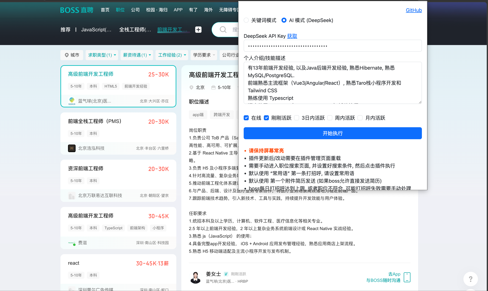

## 根据条件自动筛选符合条件的职位, 并且主动打招呼, 浏览器插件适用于boss直聘

## 安装

clone 到本地

使用 Microsoft Edge 或 Chrome 在插件管理中, 打开开发者模式, 加载解压后的插件.

## 匹配模式

### 关键词模式

职位标题包含任一关键词(空格分割)即视为匹配。

### AI 模式 (DeepSeek)

由 AI 结合职位标题、职位描述(JD)和个人介绍/技能描述综合判断匹配程度。

1. 在 [DeepSeek 开放平台](https://platform.deepseek.com/api_keys) 创建 API Key
2. 插件弹窗中选择 "AI 模式", 填入 API Key 和个人介绍/技能描述
3. AI 会对每个职位评分(0-100), 70 分及以上视为匹配, 评分与理由输出在职位详情页的控制台

注意: AI 模式下每个职位会调用一次 DeepSeek API, 会产生少量 API 费用。